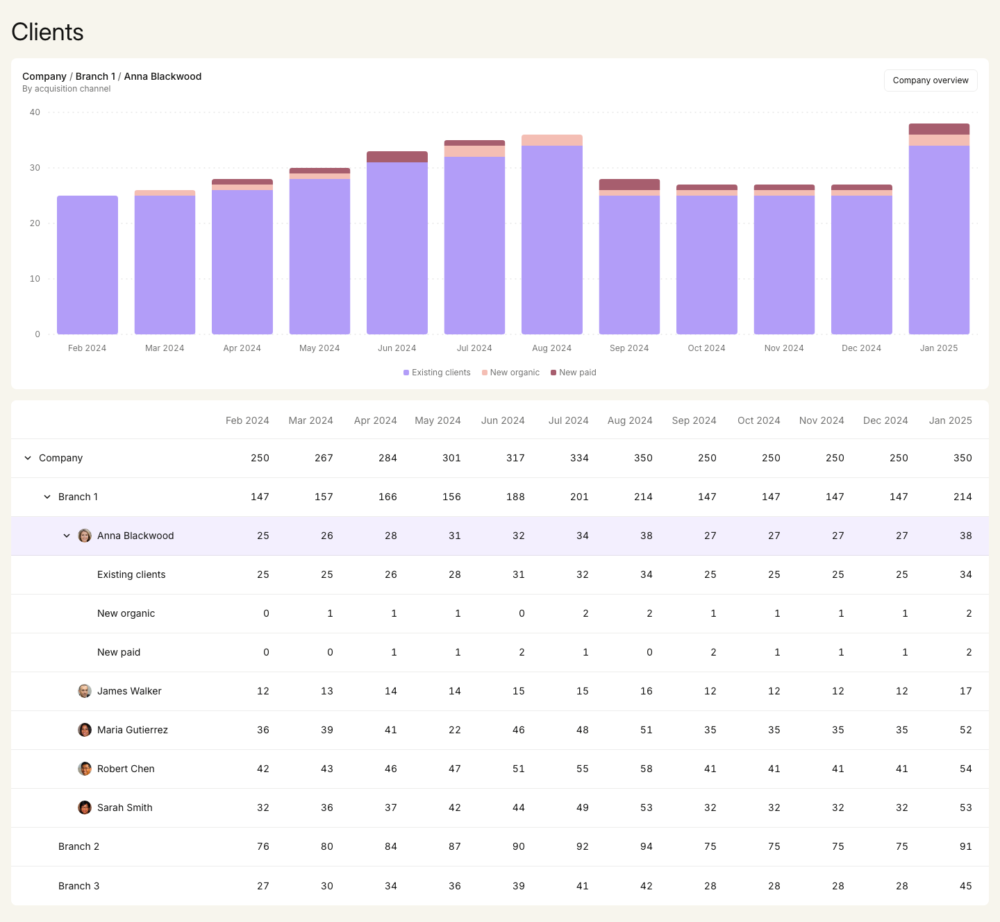

# Clients dashboard

A linked stacked bar chart and treegrid that let you explore monthly client counts from Company through branches, advisers and acquisition channels. Built with React, strict TypeScript, Vite, Tailwind CSS, Recharts and TanStack Query, and served by a Fastify REST API.



The requirements come from the original assignment brief (a PDF, not included in this repository) and from `docs/`: the RFC and the acceptance checklist. Contributor and agent rules are in [AGENTS.md](./AGENTS.md).

## Setup

Prerequisites: Node.js 22.12+ or 24 LTS (`.nvmrc` pins 24), and Corepack.

```sh
corepack enable            # uses the pnpm version pinned in package.json
pnpm install
pnpm exec playwright install chromium   # browser for Storybook tests and Playwright
```

## Commands

| Command                     | What it does                                                                                                                        |
| --------------------------- | ----------------------------------------------------------------------------------------------------------------------------------- |
| `pnpm dev`                  | Fastify API on :3001 and Vite on :5173, which proxies `/api`                                                                        |
| `pnpm storybook`            | Storybook on :6006, with MSW-driven request states                                                                                  |
| `pnpm check`                | `tsc -b`, ESLint, Prettier check, Vitest unit and Storybook interaction tests (headless Chromium)                                   |
| `pnpm test:e2e`             | Production build, then a Playwright smoke journey against the real API                                                              |
| `pnpm test:visual`          | Production build, then Playwright screenshot comparisons against `e2e/baselines/`                                                   |
| `pnpm test:visual:update`   | Regenerates baselines. Review each image against Figma before committing                                                            |
| `pnpm build` / `pnpm start` | Builds `dist/client` and `dist/server`; `start` serves both on :3000 (`PORT`, `HOST` to override; use `HOST=0.0.0.0` in containers) |

The API waits 1 s before responding so the loading skeleton is visible (`API_DELAY_MS`, default `1000`; Playwright sets it to `0`).

Playwright writes an HTML report to `playwright-report/`; open it with `pnpm exec playwright show-report`. Failure traces go to `test-results/`.

## How it works

```
shared/clientsContract.ts     wire types + runtime validation (server and client)
server/                       Fastify: GET /api/clients returns the source payload unchanged
src/api/                      fetch + TanStack Query (no auto retries or focus refetch)
src/domain/                   pure: tree index, visible rows, chart model, axis scale, palette
src/features/dashboard/       reducer/controller, page lifecycle, skeleton, error screen
src/features/chart/           ChartPanel (context, legend, overview reset) + Recharts chart
src/features/treegrid/        native table with treegrid semantics + pure keyboard mapping
```

- **One controller.** A single reducer owns `selectedId`, `expandedIds` and the logical focus location. Each user intent is one action that carries the node ID and its origin (row pointer, row keyboard, chart segment, chart legend), so related state changes together. The chart model, visible rows and roving tab stop are derived with `useMemo`. The chart depends only on the selection, so expanding rows or moving focus never rebuilds chart data.
- **Linked hover.** Hovering a table row, legend entry, breadcrumb or bar section publishes the node (and, for bar sections, the month) to a small dashboard-scoped hover store. The row takes the hover background, the legend entry darkens, the tooltip marks that series, and the chart highlights the section, or the whole series when the hover comes from outside the chart. Keyboard focus on a treegrid row (`:focus-visible`, not mouse focus) acts as hover for the chart, legend and tooltip, while the row itself keeps just its focus ring; pointer hover takes precedence while present. Hover lives outside the reducer because it changes on every pointer move; consumers subscribe through `useSyncExternalStore` selectors, so a hover re-renders only the affected rows and segments, never Recharts' layout.
- **Chart scope.** No selection means the Company overview. The chart stacks the effective node's immediate children in source order. A leaf shows its own twelve values as a single bar series, without a legend. The path and grouping ("By acquisition channel", "Monthly clients") stay visible even when the selected row is collapsed out of view.
- **Linked selection.** Row clicks, Space (and Enter on leaves), bar segments, legend buttons and the chart-header breadcrumbs (ancestors of the current scope) all dispatch the same `nodeSelected` action. Chart origins reveal only the ancestors of the selected node, make that row the treegrid's next Tab target and leave DOM focus in the chart. When an activated legend button or breadcrumb disappears with the old scope, focus moves to the chart heading instead of being lost. Tapping a segment on touch selects it directly.
- **Tooltip and pointer interaction.** The month tooltip is anchored to its bar, not the cursor: it sits to the right of the bar (or the left near the edge), centred on the stack top and clamped inside the plot, so it stays close to short bars. Hovering a stack section highlights just that section (brightness/saturation filter, so it works for any colour), and clicking it selects its node. The chart is deliberately pointer-only: Recharts' keyboard layer is off and the SVG is a single `role="img"` with an `aria-label` (no SVG `<title>`, which would add a native browser tooltip). Keyboard and screen-reader users get exact values from the treegrid, and the legend buttons remain keyboard-operable.
- **Skeleton.** The loading state is built from the same primitives as the dashboard: a Recharts chart with the shared grid, axis and margin props, gray placeholder bars and no invented Y values; and the real table header and row markup. The live chart skips its grow-in animation on first render. A Playwright test checks that panels, rows, month labels and gridlines don't move when data replaces the skeleton.
- **Treegrid.** Rows are flat sibling `<tr>`s with explicit `treegrid`/`row`/`rowheader`/`gridcell` roles and `aria-level`, `aria-posinset`, `aria-setsize`, `aria-expanded` and `aria-selected`. There is one roving tab stop, and the WAI rows-first keyboard model is implemented as a pure `resolveTreegridKey` function (see the acceptance checklist for the key table). Typeahead is buffered using event timestamps, so it is deterministic in tests.

## Assumptions and decisions

The brief left these open on purpose. Most were agreed in the RFC; this is how I resolved each one.

- **The JSON is the numeric truth, and it is internally inconsistent.** Parents don't always equal the sum of their children: May Company reports 301 while its branches sum to 279, Branch 1 Aug reports 214 against 216, and Anna Jun/Aug report 32/38 against 33/36. I show both values honestly and never normalise. The tooltip lists every series, zeros included, then "Breakdown total", and adds "Reported total" only when the source value differs.
- **Figma numbers are ignored.** The design contains typos and placeholders: Branch 1 Jul = 291 in the expanded table but 201 in the default one, Sep–Dec repeat the same values, and the chart shows Anna's channels at Company-scale heights with a hard-coded 0–400 axis. I use Figma for appearance only. The Y axis adapts to each scope: it starts at zero, uses integer ticks and rounds its upper bound up.
- **Drill-down is selection-driven.** The static design doesn't say whether the chart follows the table, so selection (from the table or the chart) picks the chart scope. With nothing selected, the chart shows the Company overview.
- **Disclosure and selection are independent.** The chevron, Enter and Right/Left expand and collapse rows; clicking a row or pressing Space selects it. Collapsing a parent keeps descendant expansion and a hidden selection; focus that would be hidden moves up to the collapsing row. "Company overview" clears the selection without touching expansion. A refresh resets everything.
- **Uneven nesting is shown as-is.** Branch 2/3 and advisers other than Anna have no children, so they are leaves: they get no chevron and no `aria-expanded`. Figma draws chevrons on Branch 2/3, which I think is a design mistake, because a disclosure that does nothing is misleading. Missing children means "no breakdown available", not an error, and I never fabricate data to fill it.
- **Chart keyboard access.** The checklist suggested reading tooltips with Recharts' keyboard layer. After review we chose a pointer-only chart instead, because the treegrid already gives full keyboard access to every value and a second keyboard surface added focus noise without adding information.
- **Palette.** The chart uses a fixed ten-colour palette. The five approved Figma colours come first, followed by five extension colours generated once. A series keeps the colour of its position among its siblings, so a selected leaf keeps its colour.

## Differences from Figma

These were added or changed deliberately, as unspecified states; none of them were supplied by the design.

- **Chart header.** It shows the scope path as clickable breadcrumbs, the grouping and a "Company overview" button, which makes the chart panel slightly taller than the 430 px frame.
- **Row and focus states.** Selected rows get a lavender tint, keyboard focus gets a blue inset ring, and hover keeps the Figma grey. A keyboard hint appears under the table while it has keyboard focus.
- **Loading and error states.** The loading skeleton, the centred error screen with Retry, and the tooltip are all new.
- **Leaf rows.** Leaves have no chevron (see above).
- **375 px layout.** The sticky name column is capped at `min(264px, 50vw)` with a divider, and the indent step shrinks from 28 px to 16 px. Long names are truncated visually but keep their full accessible name, and the table scrolls horizontally inside its panel.
- **Assets.** I use Inter Variable with the optical-size axis in place of Inter Display for the title. The adviser photos are exported from Figma and downscaled to 80 px JPEGs; any other adviser falls back to initials. The header placeholder font (Test Founders Grotesk, a commercial trial font) is invisible in the design, so I don't use it.

## Known limitations

- **Fixed year.** The month columns are hard-coded to Feb 2024–Jan 2025, as the brief specifies. A payload covering a different period would need a months field in the contract.
- **Adviser photos.** They are mapped by source ID in the client because the API has no avatar field.
- **Bundle size.** The client ships as a single ~650 kB chunk (mostly Recharts), with no code splitting.
- **Loading announcement.** It is best-effort: the status region is present from the start, but some screen readers don't announce text that is already in a live region when the page loads.

## What I would do next

- Discuss invalid data cases with the team (why reported sum differs from real sum of child elements)
- Add an avatar URL and time periods for values to the API contract instead of mapping them in the client.
- Test with VoiceOver and NVDA, and tune the treegrid and chart announcements.
- Code-split Recharts if the dashboard grows beyond this single view.
- Enable and enhance recharts keyboard navigation, if needed. (For now i decided that grid navigation is enough, its more convinient and straightforward, charts are more convinient to use with cursor.)
- Discuss with the team if we want to add more hover effects (highlight columns and bars on hover). That may be too heavy visually.
- Add conditional semi-transparent white mask to show that table is scrollable.
- If we have more variable datasets rather then annual report, prepare test cases and adapt the ui. If the data is heavy - implement a contract with pagination, branch lazy loading, table infinite scroll, virtual scroll (if that is nesesary).
- Dark theme support, i18n for ui copys, if needed.
